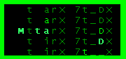



## Matrix Text Control  \(live animated screenshot\)

### Description

A simple text effect control that is best described as black background with falling green letters that reveal a message.

The controls [MatrixText] property lets you control what the message is that is revealed..nice splash sceen effect
 
### More Info
 

             |
---                |---
**Submitted On**   |2005-02-09 19:10:00
**By**             |[Evan Toder](https://github.com/Planet-Source-Code/PSCIndex/blob/master/ByAuthor/evan-toder.md)
**Level**          |Intermediate
**User Rating**    |3.0 (9 globes from 3 users)
**Compatibility**  |VB 3\.0, VB 4\.0 \(16\-bit\), VB 4\.0 \(32\-bit\), VB 5\.0, VB 6\.0, VB Script, ASP \(Active Server Pages\) , VBA MS Access, VBA MS Excel
**Category**       |[Custom Controls/ Forms/  Menus](https://github.com/Planet-Source-Code/PSCIndex/blob/master/ByCategory/custom-controls-forms-menus__1-4.md)
**World**          |[Visual Basic](https://github.com/Planet-Source-Code/PSCIndex/blob/master/ByWorld/visual-basic.md)
**Archive File**   |[Matrix\_Tex185065292005\.zip](https://github.com/Planet-Source-Code/evan-toder-matrix-text-control-live-animated-screenshot__1-58811/archive/master.zip)

